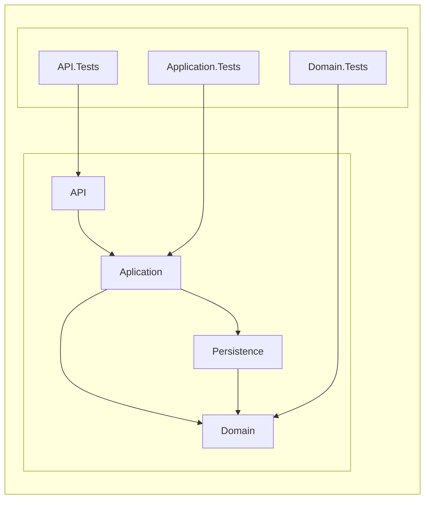

```mermaid
erDiagram
  Employee }|--|{ Contract : ""
  Client ||--|{ Contract : ""
  Contract ||--|{ WorkPlan : ""
  Employee }|--|| Position : ""
  
  Employee{
      int Id
      string FirstName
      string LastName
      int PositionId
  }

  Client{
      int Id
      string Name
      enum CodeOfTheCountry
      string RegionCode
      strin SubscriberNumber
  }

  Contract{
      int Id
      string Subject
      string Address
      decimal Price
      int ClientId
  }

  WorkPlan{
      int Id
      DateTime DateStart
      DateTime DateFinish
      int ContractId
  }
  
  Position{
      int Id
      string Name
  }
  ```
  --------------------------------------------------
  ## 1. Domain
   >#### The domain layer contains entity definitions:
   >* Сlient
   >* Contract
   >* Employee
   >* Position
   >* WorkPlan
   >#### The relationship of entities to each other.
  ## 2. Persistence
   >* Performs mediation tasks between model layers and data display
   >* Used by ORM Entity Framework Core
   >* The method was used code first
   >* A model was built using Fluent API methods.
  ## 3. Application
   >* Translating between external requests from the API(4) and Domain(1) logic (back and forth)
   >* Implementation of basic data operations (СRUD).
  ## 4. API
   >* Working with the database
   >* It provides a web interface.
```mermaid
flowchart LR
subgraph " "
    direction TB
    subgraph " "
        A0[User] --> A1[API]
        A1[API] --> A2[Aplication]
        A2[Application] --> A4[Persistence]
        A2[Application] --> A3[Domain]    
        A4[Persistence] --> A3[Domain]
    end
    subgraph " "        
        B[(Database)]   
    end
    A4[Persistence] --> B[(Database)]  
end
```
 ## Tests
>#### - Type used test XUnit Testing
>#### - Test layers:
>* Domain.Tests tests the layer Domain(1)
>* Application.Tests tests the layer Application(3)
>* API.Tests tests the layer API(4)

